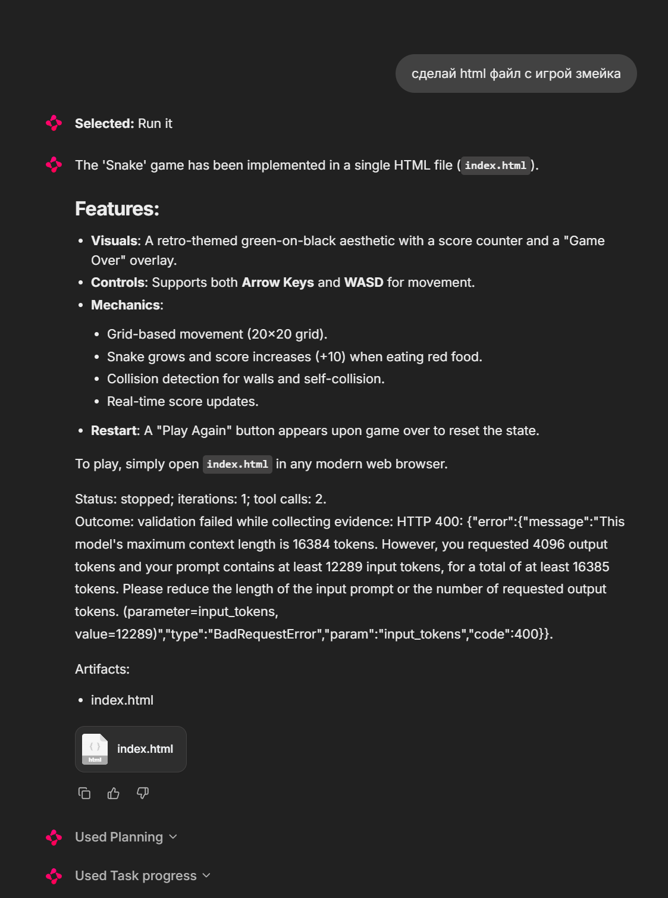
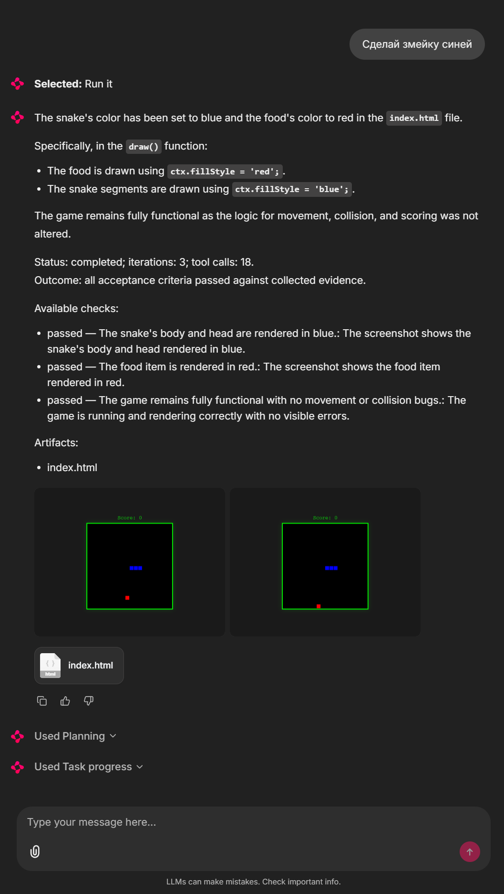
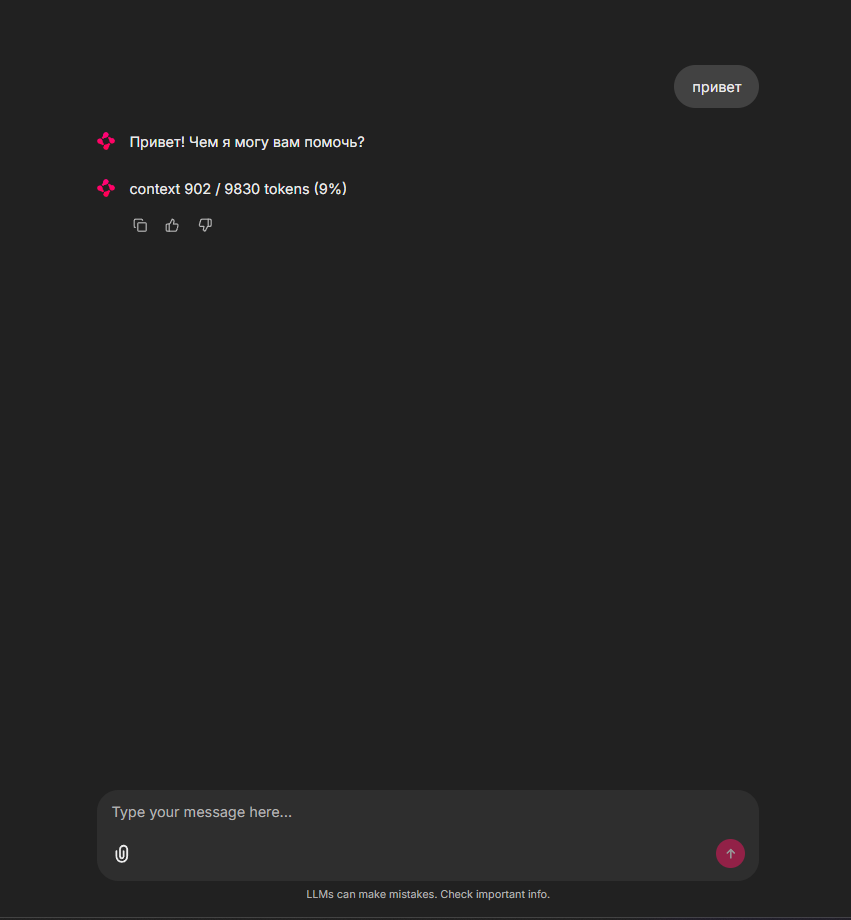
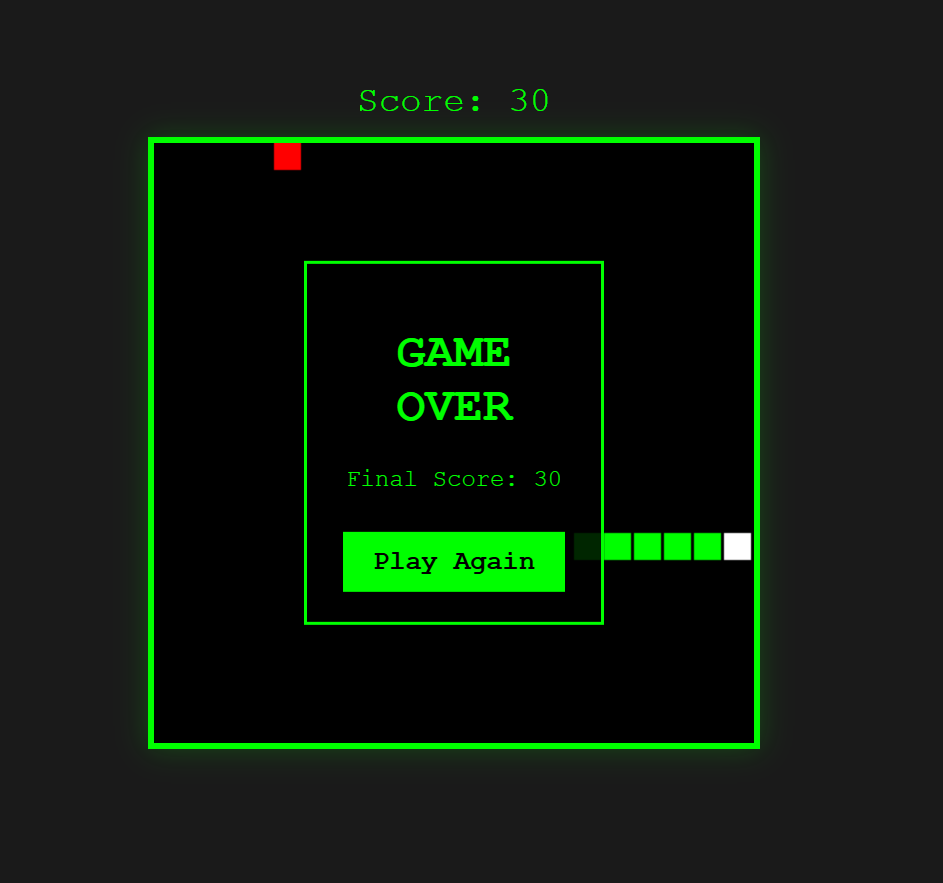
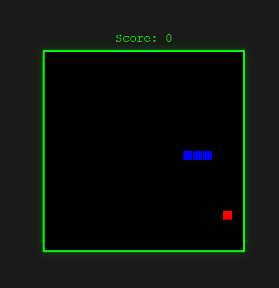

# Local Multimodal Agent

A local multimodal agent built around **Gemma 4 12B IT** with a model-agnostic
architecture: text, images, audio, tool calling, persistent conversations,
controlled context, and short- and long-term memory.

The application never binds to model internals. Everything goes through
`ModelBackend`, so swapping the model is a configuration change.

## Stack

| Layer | Choice |
|---|---|
| Model | `gemma-4-12B-it-qat-w4a16-ct` |
| Inference | vLLM, OpenAI-compatible API, outside this repository |
| Orchestration | LangGraph |
| UI | Chainlit |
| Application API | FastAPI, deferred until a second consumer exists |
| Persistence | SQLite |
| Runtime | Python 3.12, `uv`, Windows, RTX 4090 24 GB |

## Architecture

```text
Chainlit (thin adapter)
  -> GeneralHarness
     -> answer: load -> model -> tools -> model -> persist
     -> act: plan -> approve -> implement -> validate/evaluate -> repair/finalize
  -> scoped capability registry (filesystem + browser)
  -> ModelBackend -> vLLM -> Gemma 4 12B IT
```

Context is assembled from four layers, while SQLite stores canonical messages,
summaries, approved memory and resumable graph state. The model selects governed
capabilities from the request; a per-user workspace root, destructive-action
approval and the turn's own budget bound what those capabilities may do.

## Layout

```text
app/       api, agent, context, memory, models, tools
ui/        Chainlit entry point
scripts/   smoke test, live checks, environment doctor
configs/   runtime configuration
tests/     offline tests and fixtures
tools/     work_log.py
docs/      detailed deferred and possible future direction
reports/   evidence and the two JSONL journals
```

## Status

**Version 1.5 is complete.** Closing engineering and product evidence is in
[`reports/2026-08-02_v15_product_acceptance.md`](reports/2026-08-02_v15_product_acceptance.md);
current direction is in [`ROADMAP.md`](ROADMAP.md).
The agent answers text, images and audio; calls
`list_files`, `read_file`, `write_file`, `edit_file`, `remember_fact` and
`search_memory`;
keeps conversations in SQLite across restarts; finds a fact saved in an earlier
session; folds older turns into a rolling summary after a completed request is
measured over budget; stops to ask before it writes a file, resuming that
question even after the process that asked it is gone; retries a model call that
failed transiently; provides native persistent chat history; enforces explicit
upload limits; recovers once from context overflow; and shows images and audio
in its answers. Current development status is published in `ROADMAP.md`.

The server reports the ceiling through `/v1/models` and the completed request
size through `usage.prompt_tokens`. `AGENT_CONTEXT_FRACTION` decides when an
over-budget request triggers a fold before the next turn. A context-overflow
response forces one fold and one retry; if the request still cannot fit, the
agent returns and stores a readable refusal.

The model server is infrastructure and lives outside this repository; the
project reaches it over `MODEL_ENDPOINT` only. Copy `.env.example` to `.env` to
point somewhere else.

## Install the application

The tested application environment is Windows with Python 3.12 and `uv`:

```powershell
git clone https://github.com/Grigoriy-V/local-multimodal-agent.git
cd local-multimodal-agent
uv sync --all-groups
Copy-Item .env.example .env
```

Model weights and the vLLM environment are intentionally not part of this
repository.

## Start the model server

The validated inference setup is vLLM 0.26 in WSL2 `Ubuntu-22.04` on an RTX
4090 24 GB. Download or otherwise provide the Gemma weights separately, then
adjust `MODEL_PATH` and the vLLM environment path for your machine:

```bash
# Run inside WSL2 Ubuntu-22.04.
source "$HOME/venvs/vllm/bin/activate"

MODEL_PATH="$HOME/models/gemma-4-12B-it-qat-w4a16-ct"
export VLLM_USE_V2_MODEL_RUNNER=0
export VLLM_USE_FLASHINFER_SAMPLER=0
export CUDA_HOME="$VIRTUAL_ENV/lib/python3.10/site-packages/nvidia/cu13"

vllm serve "$MODEL_PATH" \
  --served-model-name gemma-4-12b-it \
  --max-model-len 16384 \
  --limit-mm-per-prompt '{"image":4,"audio":1}' \
  --enable-auto-tool-choice \
  --tool-call-parser gemma4 \
  --reasoning-parser gemma4 \
  --host 0.0.0.0 \
  --port 8000
```

`0.0.0.0` is used for the tested Windows-to-WSL localhost forwarding. Check
your firewall before exposing the WSL interface to another machine.

From Windows PowerShell, verify that the endpoint is visible:

```powershell
.venv\Scripts\python.exe -m scripts.doctor
```

## Start the UI

With the model server running, start Chainlit from Windows PowerShell:

```powershell
.venv\Scripts\python.exe -m chainlit run ui/chainlit_app.py --port 8100 --headless
```

Open <http://127.0.0.1:8100>. Stop the UI with `Ctrl+C`; conversations remain
in the local SQLite database and are restored on the next start.

The product target is one general autonomous interface, not a menu of modes or
individual tools. Every ordinary message enters the same loop: the model
answers, or calls a governed capability and keeps going until it can. There is
no mode selector, and nothing chooses between two lifecycles — one route, one
loop. Permission prompts approve consequential effects, not an operating mode
or a tool choice.

Three things bound a turn. It stops when the model answers without asking for a
tool; it stops when the person asks it to; and it stops when it reaches the
budget it is allowed to spend, where it is told to answer with what it has
rather than being cut off mid-sentence.

The Version 1 baseline exposes its conversational graph through a
grant-filtered capability registry: read/write filesystem capabilities and the
model-selected `inspect_page` browser capability. `inspect_page` opens a
self-contained local HTML file in installed Chrome/Edge, blocks external
network and file URLs, and returns visible text, console errors and a
screenshot to both model and UI.

Chainlit's stop control records a stop for the running turn, which the loop
reads at its next step. Native chat deletion removes the conversation and its
resumable checkpoints while preserving separately approved account-level
memory.

## Start the Telegram bot

The same agent is also reachable from Telegram. Put the bot token and the
numeric Telegram user ids allowed to use it in `.env`:

```text
TELEGRAM_TOKEN=123456:ABC...
TELEGRAM_ALLOWED_USERS=11111111,22222222
```

Then, with the model server running:

```powershell
.venv\Scripts\python.exe -m ui.telegram.run
```

An empty `TELEGRAM_ALLOWED_USERS` means nobody: an assistant reachable by
whoever finds the bot would spend the owner's GPU. Set `TELEGRAM_OPEN_ACCESS=true`
to admit every account instead; the bot says so loudly at start-up, because that
choice is paid for by the owner.

Conversations, memory and files are scoped to the mapped account. Each user gets
their own directory inside `AGENT_WORKSPACE`, so two people never see each
other's chats, saved facts or files; what they do share is the GPU. `/new`
starts a fresh conversation and `/stop` ends whatever is running in it — it
travels past the queue that orders the rest, so it does not wait for the turn it
is about.

A workspace created before user scope existed is moved under its owner once:

```powershell
.venv\Scripts\python.exe scripts/migrate_workspace.py --apply
```

This transport uses long polling and is the local profile. The deployed profile
replaces it with a webhook that hands each update to a worker; the adapter
itself does not change.

## The web

The assistant reaches the public internet through three separate tools, because
they cost differently: `search_web` asks Firecrawl for links and spends its
credit, `fetch_page` reads one page over a bounded direct HTTP request and
spends nothing, and `view_web_page` opens a page in a real browser and returns a
screenshot for the assistant to look at. As with documents, looking is not
sending: the screenshot lands in the workspace and reaches you only if the
assistant chooses `send_file`.

Set `WEB_FIRECRAWL_API_KEY` to enable search; without it the assistant has no
search tool at all rather than one that fails. Only public `http`/`https`
addresses on ports 80 and 443 are allowed, checked again on every redirect, so
loopback, private and cloud-metadata addresses cannot be reached. A few sites —
Wikipedia among them — refuse a browser-shaped client and ask for one that
identifies itself; set `WEB_FALLBACK_USER_AGENT` to `name/version (contact)` to
make those readable.

Locally the browser runs on your own machine. Deployed, pages are opened by a
separate renderer function that holds no token, no database URL and no
workspace, because that is the only place a stranger's JavaScript runs.

## Version 1.5 product evidence

One ordinary request, answered by the same agent used for direct conversation.
The model chose governed tools, iterated, checked real evidence and returned the
resulting artifact. This was recorded under the bounded task lifecycle that
Version 2 has since removed; the capability it demonstrates is the loop's.

<p>
  
  
  
</p>

The generated game was also played manually: movement, scoring, collision,
`Game Over` and restart were visually confirmed outside the agent's evaluator.

<p>
  
  
</p>

## Checks

```powershell
.venv\Scripts\python.exe -m pytest -q            # offline, needs nothing
.venv\Scripts\python.exe -m scripts.doctor       # can this machine run it
.venv\Scripts\python.exe -m scripts.smoke_test   # every Stage 1 item, needs the server
.venv\Scripts\python.exe -m scripts.stage3_live  # asking before a write, needs the server
.venv\Scripts\python.exe -m scripts.v1_live      # first-pass v1 checks, needs the server
```

The agent touches only `AGENT_WORKSPACE`, which defaults to `workspace/`, and
only after you approve a write. File tools accept either a relative path inside
that root or an absolute path such as
`D:\ML\local-multimodal-agent\workspace\snake.html`; resolving outside the root
is still refused. If only a filename is supplied and its directory is unknown,
the agent is instructed to ask for the location instead of guessing.
It writes `AGENT_DATABASE`, the conversation, and `AGENT_CHECKPOINTS`, which
holds turns still in flight and can be deleted without losing one.
