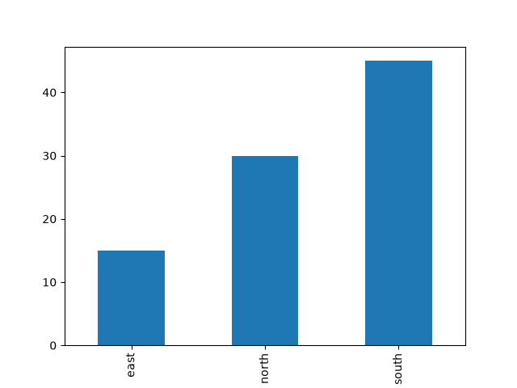

# chat-r

Run `deployed-cf8c3774-160`: 5 model calls, 4 tool calls, 23036 tokens in / 170 out, 17.5 s, outcome answer_delivered.

**Person:** In my workspace there is sales.csv with the columns region and amount. Using run_command, compute the total amount per region, save a bar chart of those totals as chart.png in my workspace, look at the chart to check it, send it to me, and tell me which region has the largest total and what it is.

`list_files`
- path: `.`

<details><summary>result</summary>

```text
.agent/
.cache/
.tmp/
Task Board/
apples.pdf
counter.html
fruit.txt
make_pdf.py
notes.txt
orchard-summary.txt
orchard.txt
plan.txt
poem.txt
primes.py
sales.csv
screenshot.png
task_board_preview.png
```

</details>

`run_command`
- command:

  ```
  python3 -c "
  import pandas as pd
  import matplotlib.pyplot as plt
  
  df = pd.read_csv('sales.csv')
  totals = df.groupby('region')['amount'].sum()
  totals.plot(kind='bar')
  plt.savefig('chart.png')
  print(totals.to_string())
  "
  ```

<details><summary>result</summary>

```text
exit code: 0   (8.1 s)
output:
region
east     15
north    30
south    45
```

</details>

`read_file`
- path: `chart.png`

<details><summary>result</summary>

```text
chart.png: an image (image/png, 8149 bytes), shown to you below.
```

</details>



`send_file`
- path: `chart.png`

<details><summary>result</summary>

```text
Selected chart.png for delivery to the person.
```

</details>


**Assistant:**

> The region with the largest total is **south** with a total of **45**.

